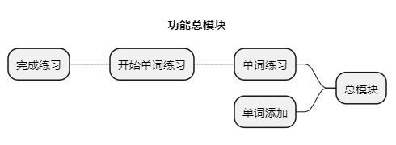

# EasyExam
 EasyExam(简单考试)刷题，记忆工具。

# 🔨主要功能/✅/❌
1. 刷题 【✅】
2. 添加题库  【❌】

# 🧰开发环境
- Visual Studio 2022  
- Avalonia for Visual Studio(Visual Studio扩展)  

- CommunityToolkit
> https://github.com/CommunityToolkit/dotnet
> https://github.com/kikipoulet/SukiUI/wiki
